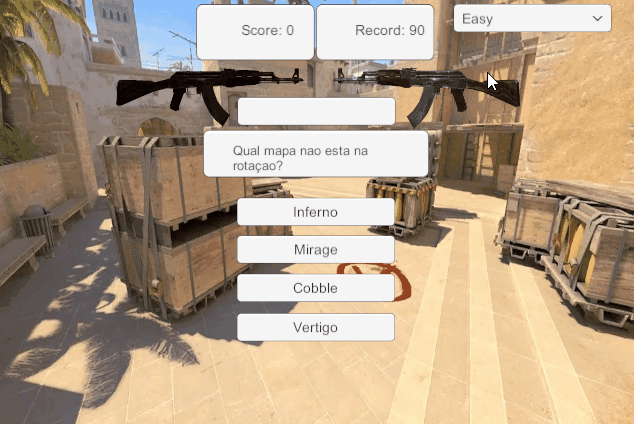

# Mentorama-Unity-Activities

Curso: **Profissão Desenvolvedor de Games em Unity** 
Módulo: **Unity Iniciante** 
Versão do Unity: **2019.4.12f1** 
Acessar os arquivos das atividades na pasta: **Files**

## Módulo 1

Primeira atividade do módulo: 
Ambientalizar-se na ferramenta unity: hierarquia, cena, layout. 
[Arquivos da Atividade](https://github.com/hicje/Mentorama-Unity-Activities/tree/main/Files/Modulo1)

## Módulo 2

Segunda atividade do módulo: 
Exportar um projeto level greybox: iluminação, prefab. 
[Arquivos da Atividade](https://github.com/hicje/Mentorama-Unity-Activities/tree/main/Files/modulo2)

## Módulo 3

Terceira atividade do módulo: 
Implementar um código que realize o cálculo de quantidade de cédulas de um valor. 
[Arquivos da Atividade](https://github.com/hicje/Mentorama-Unity-Activities/tree/main/Files/Modulo3)

## Módulo 4

Quarta atividade do módulo: 
Exportar build com 3 funcionalidades: 
- dropdown: resolução;
- checkbox: fullscreen;
- button: close apllication.

[Arquivos da Atividade](https://github.com/hicje/Mentorama-Unity-Activities/tree/main/Files/Modulo4)

## Módulo 5

Quinta atividade do módulo: 
Desenvolver um minigame (quiz) com: 
- Adicionar perguntas com dificuldades diferentes(É possivel selecionar Entre: Easy, Medium, Hard.);
- Pontuações diferentes(Em cada dificuldade.);
- Powerup: pular pergunta(Só Funciona uma vez.);
- Melhorar visual(Tematica de Counter-Strike).

[Arquivos da Atividade](https://github.com/hicje/Mentorama-Unity-Activities/tree/main/Files/Modulo5)

## Módulo 6

Sexta atividade do módulo: 
Desenvolver um projeto on deve instanciar scenes de forma aditiva conforme o player vai andando no mapa

[Arquivos da Atividade](https://github.com/hicje/Mentorama-Unity-Activities/tree/main/Files/Modulo6)

## Módulo 7

Sétima atividade do módulo: 
Desenvolver um projeto on deve criar objeto colocando força no vetor Y, para manter o máximo de tempo no ar. 
-A partir de 10 pontos, aparecem obstaculos para atrapalhar;
-Perde ao colidir com obstaculos ou com o chão;
[Arquivos da Atividade](https://github.com/hicje/Mentorama-Unity-Activities/tree/main/Files/Modulo7)

