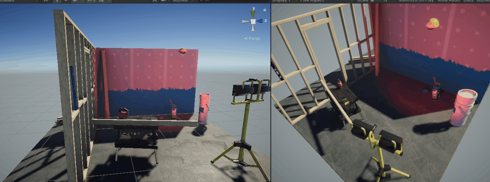

# Mentorama-Unity-Activities

Curso: **Profissão Desenvolvedor de Games em Unity** 
Módulo: **Unity Iniciante** 
Versão do Unity: **2019.4.12f1** 
Acessar os arquivos das atividades na pasta: **Files**

## Módulo 1

Primeira atividade do módulo: 
Ambientalizar-se na ferramenta unity: hierarquia, cena, layout. 
[Arquivos da Atividade](https://github.com/hicje/Mentorama-Unity-Activities/tree/main/Files/Modulo1)

## Módulo 2

Segunda atividade do módulo: 
Exportar um projeto level greybox: iluminação, prefab. 
[Arquivos da Atividade]()

